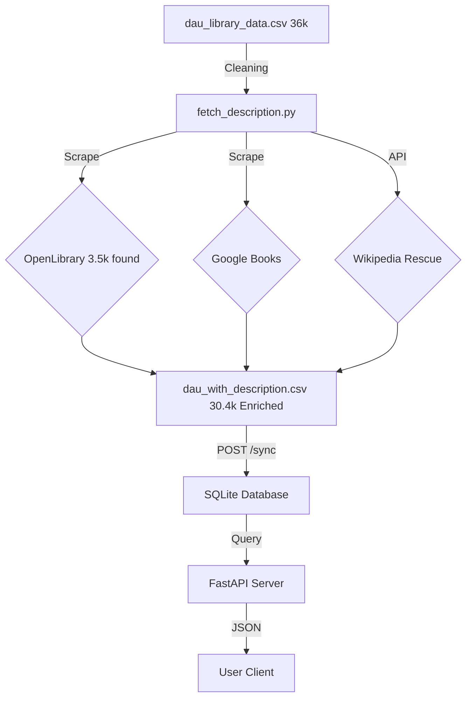

# Big Data Engineering Project Workflow

## Project Overview
This project is a **Book Library Data Pipeline** that fetches book descriptions from multiple sources (OpenLibrary, Google Books, Wikipedia), stores them in a SQLite database, and exposes the data through a professional FastAPI REST API.

---

## Architecture & Workflow

### 1. **Data Collection & Enrichment** (`Data-Building/`)

#### Input
- **Source**: `dau_library_data.csv` - Raw library data with book metadata
  - Columns: Acc_Date, Acc_No, Title, ISBN, Author_Editor, Edition_Volume, Place_Publisher, Year, Pages, Class_No

#### Processing: `fetch_description.py` & `rescue_script.py`
The pipeline enriches raw data by fetching descriptions using a **multi-stage fallback strategy**.

**Steps:**
1. **Load & Clean Data**
   - Read CSV file (encoding: latin1)
   - Remove duplicate records based on Title, ISBN, and Author.
   - Initialize description column with "Not Found".

2. **Fetch from OpenLibrary** (First Priority)
   - Query: `https://openlibrary.org/isbn/{ISBN}`
   - Extract description via HTML scraping.
   - Rate limit: 1 second delay per request.

3. **Fetch from Google Books** (Second Priority - Scraper)
   - For missing descriptions, query: `https://books.google.com/books?vid=ISBN{ISBN}`
   - Scrape synopsis from `<div id="synopsis">`.

4. **Fetch from Google Books API** (Third Priority - Fuzzy Search)
   - If ISBN fails, search by **Title + Author** using the Google Books API.
   - Handles invalid ISBNs effectively.

5. **Fetch from Wikipedia** (Final Rescue - API)
   - **New Feature:** For stubborn records, utilize the `wikipedia` Python library.
   - Search query: `"{Title} (novel)"` to find book summaries.
   - Fills remaining gaps to ensure maximum data coverage.

#### Output
- **File**: `Data/processed/dau_with_description.csv`
- Contains all original columns + new `description` column.

---

### 2. **Data Statistics (Enrichment Results)**

Our multi-stage pipeline achieved significant data enrichment coverage.

| Stage | Action | Result |
| :--- | :--- | :--- |
| **1. Input** | Initial Raw Data | **36,000** Total Rows |
| **2. OpenLibrary** | Attempted on first 5,000 rows | Found **~3,500** descriptions |
| **3. Google Books** | Merged OpenLibrary + Google Books results | **9,000** rows still "Not Found" (25% gap) |
| **4. Wikipedia** | Applied Rescue Script on "Not Found" rows | Recovered thousands of missing descriptions |
| **5. Final Output** | **Final Enriched Dataset** | **30,400** Books with Descriptions (84% Coverage) |

---

### 3. **Database Setup** (`Database/`)

#### Script: `SQLite3.py` (Manual) or `/sync` Endpoint (Automated)
Loads the enriched CSV data into SQLite3 database.

**Schema:**
```sql
CREATE TABLE books (
    id INTEGER PRIMARY KEY AUTOINCREMENT,
    acc_no TEXT,
    title TEXT,
    isbn TEXT,
    author_editor TEXT,
    description TEXT,
    ...
);
```

---

### 4. **REST API** (`API/`)

#### Script: `main.py`

A robust FastAPI server providing access to the library catalog.

**Technology Stack:**

* Framework: FastAPI
* Server: Uvicorn
* Database: SQLite3
* **New Feature:** Dependency Injection for database connections.

**Endpoints:**

| Method | Endpoint | Description |
| --- | --- | --- |
| GET | `/` | Health check to verify API status |
| GET | `/books` | Fetch books with pagination (`limit`, `offset`) |
| GET | `/search` | **Search books by Title or Author** (SQL LIKE) |
| GET | `/books/{isbn}` | Fetch a single book by ISBN (auto-cleans dashes) |
| POST | `/sync` | **ETL Trigger:** Wipes DB and reloads fresh data from CSV |

---

## Full Data Pipeline Flow

```

---

## File Structure
```
Big-Data-Engineering-/
├── API/
│   ├── main.py               # Main FastAPI Application (formerly book_api.py)
│   └── __pycache__/
├── Data/
│   ├── raw_data/             # Original CSV files
│   └── processed/            # Enriched data
│       └── dau_with_description.csv
├── Data-Building/
│   ├── fetch_description.py  # Primary scraping script
│   └── wiki_rescue.py        # Wikipedia fallback script
├── Database/
│   ├── db.sqlite3            # SQLite database file
│   └── SQLite3.py            # Manual loader script
├── logs/
│   └── prompt.md
├── requirements.txt          # Python dependencies
└── README.md
```

---

## Dependencies
```txt
requests          # HTTP requests
beautifulsoup4    # HTML parsing
fastapi           # REST API framework
pandas            # Data processing
uvicorn           # Server
wikipedia         # Wikipedia API wrapper
```

Install: `pip install -r requirements.txt`

---

## How to Run

### Step 1: Fetch Book Descriptions
```bash
cd Data-Building/
python fetch_description.py
# (Optional) Run wikipedia rescue if needed
```

### Step 2: Start API Server
```bash
cd API/
uvicorn main:app --reload --host 0.0.0.0 --port 8000
# API available at: http://localhost:8000
```

### Step 3: Initialize Database (Via API)

Instead of running a manual script, you can now trigger the load via the API:
```bash
curl -X POST http://localhost:8000/sync
# Output: {"status": "success", "message": "Synced 30400 books."}
```

### Step 4: Search for Books
```bash
# Search by Title
curl "http://localhost:8000/search?q=Harry+Potter"
```
